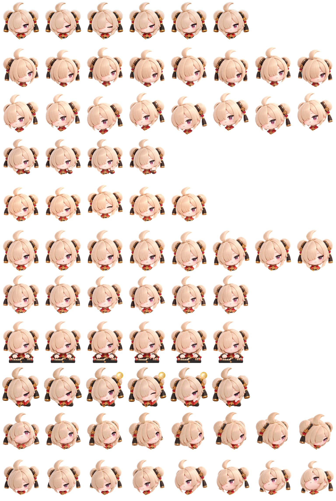

# 红豆 Hongdou Pet for Codex

用于 Codex 的红豆自定义虚拟宠物素材。采用 AI 辅助设计，视觉参考了《绝区零》，并加入独立的人设、造型调整和动画。免费公开分享。

本项目是用户制作的自定义形象素材，并非 OpenAI、Codex 或《绝区零》的官方作品或获授权联名。使用前请阅读 [素材权利说明](ASSET-NOTICE.md)。

## 内容

- [透明 PNG 精灵图集](assets/hongdou-spritesheet.png)：1536 × 2288，RGBA。
- [九个动作完整视频](previews/all-states.mp4)。
- [16 个朝向循环预览](previews/look-loop.gif)。
- [全部动作及朝向逐帧总览](previews/contact-sheet.png)。
- [第 8 项：键盘打字预览](previews/8-typing.mp4)。
- [第 9 项：托腮思考、灯泡亮起预览](previews/9-review.mp4)。

## 动作说明

图集包含九个动画状态，共 57 个动作帧，另有 16 个朝向。帧数与朝向数量是素材数量，不代表以 60 fps 制作或播放；实际播放节奏取决于宿主应用。

1. [待机 idle](previews/states/idle.gif)：6 帧。
2. [向右移动 running-right](previews/states/running-right.gif)：8 帧。
3. [向左移动 running-left](previews/states/running-left.gif)：8 帧。
4. [挥手 waving](previews/states/waving.gif)：4 帧。
5. [跳跃 jumping](previews/states/jumping.gif)：5 帧。
6. [失败 failed](previews/states/failed.gif)：8 帧。
7. [等待 waiting](previews/states/waiting.gif)：6 帧。
8. [键盘打字 running](previews/states/running.gif)：6 帧；另附 [MP4](previews/8-typing.mp4)。
9. [托腮思考 review](previews/states/review.gif)：6 帧，灯泡在第 3–5 帧亮起；另附 [MP4](previews/9-review.mp4)。

16 个朝向按顺时针排列，每隔 22.5° 一个姿态，起点为向上。总览图中的帧索引从 0 开始；绿色格为有效帧，红色空格为图集预留位置。

第 8 项使用敲键盘动作；第 9 项为审阅状态，表现为托腮思考后灯泡亮起。预览视频用浅色和深色背景并排展示同一动画。视频中的英文状态标签用于标识动作槽位；第 8 项画面中的 running 标签对应这里的键盘打字动作。

## 如何使用

本素材面向支持自定义宠物 v2 图集格式的 Codex 客户端。下载完整 PNG 图集后，通过客户端实际提供的宠物导入或配置功能使用；具体入口和支持范围取决于客户端版本，不保证所有平台都能导入或触发全部状态。

本包提供宠物素材与预览，不包含 Codex 客户端源码、安装程序或通用导入器，不能独立运行。若要在其他应用中使用，需要确认格式适配及所需权利许可。

## 权利与使用边界

免费公开不等于授予第三方角色的商业使用权。本包不对整套图片或视频采用 MIT 许可证，不声明已取得《绝区零》角色的官方授权。原作角色、名称、标识等相关权利归各自权利人所有。AI 辅助生成不会消除第三方权利。

详细说明见 [ASSET-NOTICE.md](ASSET-NOTICE.md)。
